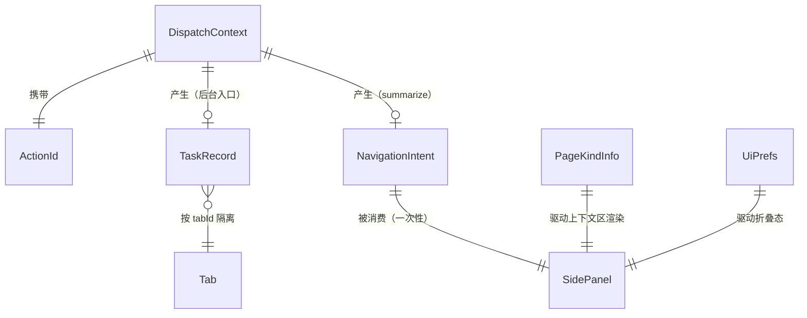

# Data Model: 交互入口与侧边栏布局重构

> 本功能无后端/数据库，"数据模型"= TypeScript 类型（`src/shared/types.ts`）+ chrome.storage 结构（键名集中 `src/shared/constants.ts` 的 `STORAGE_KEYS`）。

## 实体关系



## 类型定义

### ActionId（新增，types.ts）

统一动作枚举，右键菜单项 id、command 名、侧边栏消息在分发层收敛到它：

```ts
export type ActionId =
  | 'page-md'          // 整页转 Markdown 并复制
  | 'selection-md'     // 选区转 Markdown（仅右键）
  | 'screenshot'       // 整页截图（右键/快捷键固定 png）
  | 'summarize'        // AI 总结 → 只发导航意图
  | 'unlock'           // 解除复制限制
  | 'open-panel'       // 打开侧边栏
  | 'feishu-md' | 'feishu-pdf' | 'feishu-html';  // 飞书导出
```

约束：枚举封闭；新增动作必须同步更新 `resolveAction` 路由表与其单测。

### DispatchContext（新增）

| 字段 | 类型 | 约束 | 说明 |
|---|---|---|---|
| `tabId` | `number` | 必填 | 触发瞬间捕获，全链路唯一目标 |
| `url` | `string` | 必填 | 触发瞬间的页面地址（用于分类/校验，不再回查） |
| `source` | `'menu' \| 'command' \| 'panel'` | 必填 | 触发来源（反馈策略：menu/command 走 badge，panel 走侧边栏状态栏） |

不变式：**dispatch 之下任何函数不得调用 `chrome.tabs.query({active:true})`**（单测锁定）。

### TaskRecord（新增）

| 字段 | 类型 | 约束 | 说明 |
|---|---|---|---|
| `id` | `string` | 必填，`${tabId}-${seq}` | 记录标识 |
| `tabId` | `number` | 必填 | 所属标签页 |
| `actionId` | `ActionId` | 必填 | 哪个动作 |
| `status` | `'running' \| 'success' \| 'error'` | 必填 | 结束态不可再变 |
| `error` | `string` | status='error' 时必填 | 失败原因（展示用，已本地化） |
| `startedAt` / `endedAt` | `number` | startedAt 必填 | 毫秒时间戳 |

存储：`storage.session`，键 `larksnap:tasks:<tabId>`，数组按时间倒序，**每 tab 上限 10 条**（超出裁尾）。

### NavigationIntent（新增）

| 字段 | 类型 | 约束 | 说明 |
|---|---|---|---|
| `target` | `'summary'` | 必填，当前唯一取值 | 侧边栏定位目标 |
| `autoStart` | `boolean` | 必填 | 是否自动开始 |
| `tabId` | `number` | 必填 | 总结的目标页 |
| `url` | `string` | 必填 | 同上 |
| `createdAt` | `number` | 必填 | 超过 30s 未消费视为过期丢弃 |

存储：`storage.session`，键 `larksnap:intent`，**单槽覆盖写、读到即删**（一次性语义）。

### PageKindInfo（扩展，types.ts:387-393）

```ts
// 现状                                    // 目标
type PageKind =                            type PageKind =
  | 'feishu' | 'youtube'                     | 'feishu' | 'youtube' | 'video'
  | 'generic' | 'restricted';                | 'generic' | 'restricted';

interface PageKindInfo {                   interface PageKindInfo {
  kind: PageKind;                            kind: PageKind;
  url?: string;                              url?: string;
}                                            title?: string;          // 页面识别条
                                             videoSite?: VideoSiteId; // kind='video'|'youtube' 时存在
                                           }
```

分类函数 `classifyPage(url, title?)` 判定顺序（互斥完备）：非 http(s) → `restricted`；飞书双信号 → `feishu`；YouTube → `youtube`；`matchSite` 命中其余站点 → `video`；否则 `generic`。

### UiPrefs（新增）

| 字段 | 类型 | 约束 | 说明 |
|---|---|---|---|
| `collapsedGroups` | `Record<'webcopy'\|'screenshot'\|'summary'\|'pageToggles', boolean>` | 缺省值见下 | 通用工具分组折叠态 |

默认：`webcopy: false`（展开），其余 `true`（折叠）。存储：`storage.local`，键 `larksnap:ui-prefs`。

### ActionItem 分组（改造，sidepanel/actions.ts）

`ActionItem` 增 `group: 'export' | 'publish' | 'misc'`；删除 `word`（永久 disabled 占位）、`cacheList`（并入 header 缓存库图标）、`diagnostic`/`feedback`（移页脚）。渲染层按组布局：export = 4 主按钮网格，publish = 样式下拉直选行，misc = 缓存到本地。

## STORAGE_KEYS 增量（constants.ts）

| 键 | 存储区 | 生命周期 | 内容 |
|---|---|---|---|
| `larksnap:tasks:<tabId>` | session | 浏览器会话；tab 关闭由记录自然过期（读取时校验 tab 存在） | `TaskRecord[]` |
| `larksnap:intent` | session | 单槽、读后删、30s 过期 | `NavigationIntent` |
| `larksnap:ui-prefs` | local | 永久 | `UiPrefs` |

## 状态转换

### 角标生命周期（按 tab）

```text
(无角标) --动作结束 success--> 绿"✓" --打开侧边栏 / 切到该 tab--> (清除)
(无角标) --动作结束 error----> 红"!" --同上--> (清除)
任意角标 --同 tab 新任务结束--> 被新状态覆盖（任务记录各自保留）
任意角标 --tab 关闭--> 浏览器自动清除（per-tab badge 原生行为）
```

### 导航意图生命周期

```text
(空槽) --右键/快捷键 summarize--> 已写入 + sidePanel.open(tabId)
已写入 --侧边栏挂载读取 / storage.onChanged 捕获--> 消费并删除 → SummaryView 自动开始
已写入 --30s 未消费--> 下次读取时判过期丢弃
已写入 --再次触发--> 覆盖写（后者优先）
```

## 校验规则

- **类型层**：全部走 TypeScript strict 编译期约束；`ActionId`/`PageKind` 为封闭 union，switch 必须穷尽（`never` 兜底）。
- **运行时**：`storage.session` 读出的 `NavigationIntent`/`TaskRecord` 做形状校验（字段存在性 + 类型），不合法即丢弃——SW 与 UI 版本短暂不一致（扩展更新瞬间）时不崩溃。
- **前端**：折叠态读取失败回退默认值；任务记录渲染时 `error` 文案直接展示（写入侧已本地化）。
